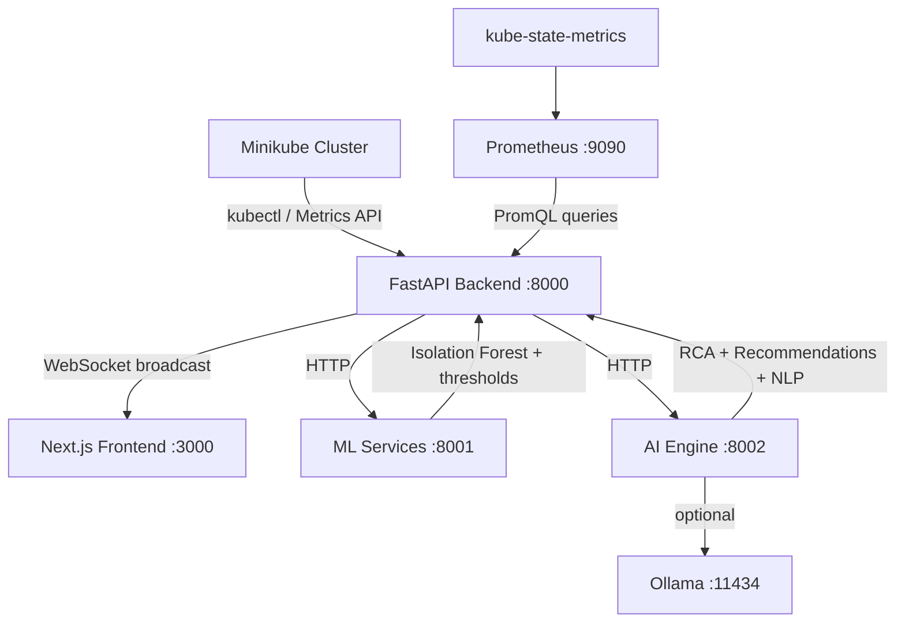

# KubeMind: Real-Time AI Kubernetes Intelligence Platform

Transform KubeMind from a simulated telemetry dashboard into a **live AI-powered Kubernetes behavior intelligence platform** — connecting to your real Minikube cluster, Prometheus stack, and Metrics Server.

## Architecture Overview



---

## What's Being Changed vs Preserved

| Layer | Old (Simulated) | New (Real) |
|---|---|---|
| `simulator.py` | Generates random metrics | **DELETED** — replaced by `k8s_collector.py` |
| `backend/app/main.py` | Imports simulator | Imports real collector |
| `backend/app/core/config.py` | K8S_SIMULATION_MODE=True | K8S_SIMULATION_MODE=False |
| `backend/requirements.txt` | `kubernetes==30.1.0` already present | Add `aiohttp`, `prometheus-api-client` |
| `rca_engine.py` | Static hardcoded deps | **Dynamic** — reads live topology from K8s |
| `frontend/src/types/index.ts` | simulation_mode field | Add real K8s fields (node_name, pod_name, pvc_name, events) |
| `frontend/src/components/dashboard/PodGrid.tsx` | Preserved | Minor field additions |
| `frontend/src/components/dashboard/DependencyGraph.tsx` | Static color map | Dynamic namespace colors |
| `docker-compose.yml` | No KUBECONFIG mount | Mount kubeconfig for local dev |
| `k8s/` directory | Empty/basic | Full RBAC + ServiceAccount manifests |

---

## User Review Required

> [!IMPORTANT]
> The frontend UI design is **fully preserved**. The same tabs (Dependency Graph, Infrastructure Map, Anomaly Timeline, Recommendations), same glassmorphism styling, same WebSocket hook, same stat cards — all preserved. Only the DATA SOURCE changes.

> [!WARNING]
> **Prometheus URL**: The backend will query `http://localhost:9090` by default for local dev. If you ran Prometheus via Helm in Minikube, you'll need to port-forward it: `kubectl port-forward svc/prometheus-kube-prometheus-prometheus 9090:9090 -n monitoring`. This is documented in the commands section below.

> [!IMPORTANT]
> **Ollama (AI insights)**: If Ollama is not running, the AI engine gracefully falls back to rule-based insights. No action needed.

---

## Open Questions

> [!NOTE]
> **Prometheus namespace**: Did you install Prometheus via `helm install prometheus prometheus-community/kube-prometheus-stack`? If so, it's likely in the `monitoring` namespace. Or did you install it differently? The port-forward command needs the correct namespace. The default in this plan is `monitoring`.

> [!NOTE]
> **Fault Injector**: The current UI has a "Fault Injector" panel that injects faults into simulated services. With real Kubernetes, this becomes a "Chaos Engineering" panel. We'll preserve the UI panel but change the action to scale deployments up/down (a safe real-world equivalent). Do you want to keep this, or remove the panel entirely?

---

## Proposed Changes

### PHASE 1: Backend — Real Kubernetes Collector

---

#### [DELETE] `backend/app/core/simulator.py`
Remove completely. All random metric generation goes away.

---

#### [NEW] `backend/app/core/k8s_collector.py`
The heart of the transformation. This single file replaces `simulator.py` and implements:

- **`_init_k8s_client()`** — tries `load_incluster_config()` first, falls back to `load_kube_config()` for local dev
- **`collect_pod_metrics()`** — calls `CoreV1Api` to list pods + container statuses, restart counts, probe failures, phase, conditions
- **`collect_metrics_api()`** — calls `CustomObjectsApi` for `metrics.k8s.io/v1beta1` pods/nodes (CPU in nanocores → %, memory in bytes → MB)
- **`collect_prometheus_metrics()`** — async PromQL queries via `aiohttp`:
  - `container_cpu_usage_seconds_total` → CPU %
  - `container_memory_working_set_bytes` → Memory MB
  - `kube_pod_container_status_restarts_total` → restart count
  - `container_network_receive_bytes_total` → network in kbps
  - `container_network_transmit_bytes_total` → network out kbps
  - `kubelet_volume_stats_used_bytes / kubelet_volume_stats_capacity_bytes` → PVC %
- **`collect_deployments()`** — replicas, ready replicas, selector labels
- **`collect_services()`** — discovers service → pod label selectors to build dependency graph
- **`collect_events()`** — Warning events, CrashLoopBackOff, OOMKilled, BackOff
- **`collect_nodes()`** — node capacity, allocatable, conditions
- **`build_topology()`** — generates live nodes+links from real K8s service relationships
- **`generate_all_metrics()`** — unified function returning same shape as old simulator (so downstream ML/AI code needs zero changes)
- **`get_cluster_summary()`** — real counts from live data
- **Metric history** — rolling 120-sample in-memory buffer per pod (same as old simulator)

**Key design decision**: The output schema of `generate_all_metrics()` and `get_cluster_summary()` is identical to the old simulator. This means `backend/app/main.py` requires **minimal changes** — just swap the import.

---

#### [MODIFY] `backend/app/main.py`
- Replace import: `from app.core.simulator import ...` → `from app.core.k8s_collector import ...`
- Remove `inject_fault` / `clear_fault` / `list_faults` imports (or keep with no-op stubs for UI compatibility)
- Add `inject_fault` / `clear_fault` stubs that scale K8s deployments (or simply return no-op)
- Add `/api/v1/nodes` endpoint for node metrics
- Add `/api/v1/events` endpoint for cluster events
- Add `/api/v1/namespaces` endpoint
- Update health check to show `simulation_mode: False`

---

#### [MODIFY] `backend/app/core/config.py`
- Change default: `K8S_SIMULATION_MODE: bool = False`
- Add: `PROMETHEUS_URL: str = "http://localhost:9090"`
- Add: `METRICS_COLLECTION_INTERVAL: int = 3` (seconds)
- Add: `K8S_NAMESPACE_FILTER: str = ""` (empty = all namespaces)

---

#### [MODIFY] `backend/requirements.txt`
Add:
```
aiohttp==3.9.5
prometheus-api-client==0.5.5
```
(kubernetes==30.1.0 already present)

---

### PHASE 2: AI Engine — Real K8s-Aware Intelligence

---

#### [MODIFY] `ai-engine/rca_engine.py`
- Remove hardcoded `SERVICE_DEPENDENCIES` dict (was for simulated services)
- Accept `topology` parameter passed in from the backend's live topology
- Build dependency graph dynamically from real K8s service relationships
- Add NetworkX for graph traversal (cascade failure detection)
- Detect: CrashLoopBackOff chains, OOM cascades, PVC stress → restart chains

---

#### [MODIFY] `ai-engine/recommendation_engine.py`
- Add real K8s recommendations:
  - CrashLoopBackOff → check liveness probe, inspect logs
  - OOMKilled → increase memory limits, set requests properly
  - High restart count → rolling restart recommendation
  - PVC >90% → expand PVC or clean up
  - CPU throttling → increase CPU limits or scale horizontally
- Add pod-level recommendations (not just service-level)

---

#### [MODIFY] `ai-engine/requirements.txt`
Add: `networkx==3.3`

---

### PHASE 3: ML Services — Real Thresholds for K8s

---

#### [MODIFY] `ml-services/anomaly_detector.py`
- Update `SEVERITY_THRESHOLDS` to K8s-realistic values:
  - CPU: warning >70%, critical >90% (same)
  - Memory: warning >80% of limit (was fixed MB), critical >95%
  - Restarts: warning >3, critical >5 (was 2/5)
  - PVC: add `pvc_usage_percent` threshold warning >80%, critical >95%
- Add detection for: `OOMKilled`, `CrashLoopBackOff` status directly from pod events
- Add `pod_phase` anomaly (Pending >5min, Failed, Unknown)

---

### PHASE 4: Frontend — New Fields + NLP Panel

The **UI is preserved**. Only additions, no removals.

---

#### [MODIFY] `frontend/src/types/index.ts`
Add to `ServiceMetrics`:
```typescript
pod_name?: string;
node_name?: string;
pod_phase?: string;
pvc_usage_percent?: number;
events?: K8sEvent[];
container_count?: number;
```
Add `K8sEvent` interface. Update `ClusterSummary` — change `simulation_mode: boolean` → `simulation_mode: false`.

---

#### [MODIFY] `frontend/src/components/dashboard/PodGrid.tsx`
- Add node_name display in card footer
- Add pod phase badge (Pending = amber, Failed = red)
- Add PVC usage bar if `pvc_usage_percent` is present
- Show real event badges (OOMKilled, BackOff) from pod events

---

#### [NEW] `frontend/src/components/dashboard/NLPInsightsPanel.tsx`
New panel added to the right sidebar (below Predictive Risk):
- Displays AI-generated natural language operational summaries
- Pulled from RCA reasoning + anomaly correlation
- Shows timestamps, severity color coding
- Examples: "Cluster health degrading due to storage latency in monitoring namespace."

---

#### [MODIFY] `frontend/src/app/page.tsx`
- Add `NLPInsightsPanel` to right sidebar
- Update stat cards to show real node count and real namespace count
- Update `ClusterHeader` to show `LIVE` badge (remove simulation indicator)

---

### PHASE 5: Infrastructure — Kubernetes Manifests & Helm

---

#### [NEW] `k8s/rbac.yaml`
ClusterRole + ClusterRoleBinding allowing KubeMind to:
- `get`, `list`, `watch` pods, nodes, services, deployments, replicasets, daemonsets, statefulsets, events, persistentvolumeclaims, endpoints, namespaces
- `get` metrics.k8s.io (Metrics API)

---

#### [NEW] `k8s/serviceaccount.yaml`
ServiceAccount `kubemind-sa` in `kubemind` namespace.

---

#### [NEW] `k8s/deployment.yaml`
KubeMind backend deployment using `kubemind-sa`, with environment variables for Prometheus URL (pointing to in-cluster service).

---

#### [MODIFY] `docker-compose.yml`
- Mount `~/.kube/config` into backend container for local dev
- Add `PROMETHEUS_URL=http://prometheus:9090`
- Remove `K8S_SIMULATION_MODE=true` (default is now false)

---

#### [MODIFY] `.env`
- Set `K8S_SIMULATION_MODE=false`
- Set `PROMETHEUS_URL=http://localhost:9090`

---

## Verification Plan

### Automated / Command Verification
```powershell
# 1. Port-forward Prometheus (keep running in separate terminal)
kubectl port-forward svc/prometheus-kube-prometheus-prometheus 9090:9090 -n monitoring

# 2. Start backend
cd backend
pip install -r requirements.txt
uvicorn app.main:app --reload --host 0.0.0.0 --port 8000

# 3. Verify real metrics
curl http://localhost:8000/api/v1/cluster/summary
# Expected: simulation_mode: false, real namespace names

curl http://localhost:8000/api/v1/metrics
# Expected: real pod names from your Minikube cluster

# 4. Start frontend
cd frontend && npm run dev

# 5. Open browser: http://localhost:3000
# Expected: Live pods from Minikube shown in the Infrastructure Map tab
# Expected: Real namespaces in the namespace filter pills
# Expected: WebSocket status shows LIVE (green dot)
```

### Manual Browser Verification
- Infrastructure Map tab shows real pods (kube-system, monitoring namespaces)
- Dependency Graph shows real service relationships discovered from K8s
- Namespace filter pills show: `kube-system`, `monitoring`, `default`, etc.
- NLP Insights panel shows AI-generated operational summaries
- Anomaly detection fires when a real pod is in CrashLoopBackOff or OOMKilled

---

## Exact Command Sequence (Local Dev)

```powershell
# Terminal 1: Ensure Minikube is running
minikube start
minikube addons enable metrics-server
kubectl top pods -A  # verify metrics work

# Terminal 2: Port-forward Prometheus
kubectl port-forward svc/prometheus-kube-prometheus-prometheus 9090:9090 -n monitoring

# Terminal 3: Start ML service
cd C:\Users\ganga\Desktop\kubemind\ml-services
pip install -r requirements.txt
uvicorn main:app --host 0.0.0.0 --port 8001 --reload

# Terminal 4: Start AI engine
cd C:\Users\ganga\Desktop\kubemind\ai-engine
pip install -r requirements.txt
uvicorn main:app --host 0.0.0.0 --port 8002 --reload

# Terminal 5: Start backend
cd C:\Users\ganga\Desktop\kubemind\backend
pip install -r requirements.txt
uvicorn app.main:app --host 0.0.0.0 --port 8000 --reload

# Terminal 6: Start frontend
cd C:\Users\ganga\Desktop\kubemind\frontend
npm run dev
```

---

## Files Summary

| File | Action | Description |
|---|---|---|
| `backend/app/core/simulator.py` | **DELETE** | Remove all fake telemetry |
| `backend/app/core/k8s_collector.py` | **NEW** | Real K8s + Prometheus collector |
| `backend/app/main.py` | **MODIFY** | Swap simulator import → k8s_collector |
| `backend/app/core/config.py` | **MODIFY** | Default simulation_mode=False, add Prometheus URL |
| `backend/requirements.txt` | **MODIFY** | Add aiohttp, prometheus-api-client |
| `ai-engine/rca_engine.py` | **MODIFY** | Dynamic topology from real K8s, NetworkX |
| `ai-engine/recommendation_engine.py` | **MODIFY** | Real K8s-aware recommendations |
| `ai-engine/requirements.txt` | **MODIFY** | Add networkx |
| `ml-services/anomaly_detector.py` | **MODIFY** | K8s-realistic thresholds, OOMKilled detection |
| `frontend/src/types/index.ts` | **MODIFY** | Add K8s fields (pod_name, node_name, events, pvc) |
| `frontend/src/components/dashboard/PodGrid.tsx` | **MODIFY** | Display node_name, PVC bar, event badges |
| `frontend/src/components/dashboard/NLPInsightsPanel.tsx` | **NEW** | AI-generated operational summaries |
| `frontend/src/app/page.tsx` | **MODIFY** | Add NLPInsightsPanel to sidebar |
| `docker-compose.yml` | **MODIFY** | Mount kubeconfig, Prometheus URL |
| `.env` | **MODIFY** | K8S_SIMULATION_MODE=false |
| `k8s/rbac.yaml` | **NEW** | ClusterRole for K8s API access |
| `k8s/serviceaccount.yaml` | **NEW** | ServiceAccount for in-cluster deployment |
| `k8s/deployment.yaml` | **NEW** | KubeMind backend K8s deployment |
